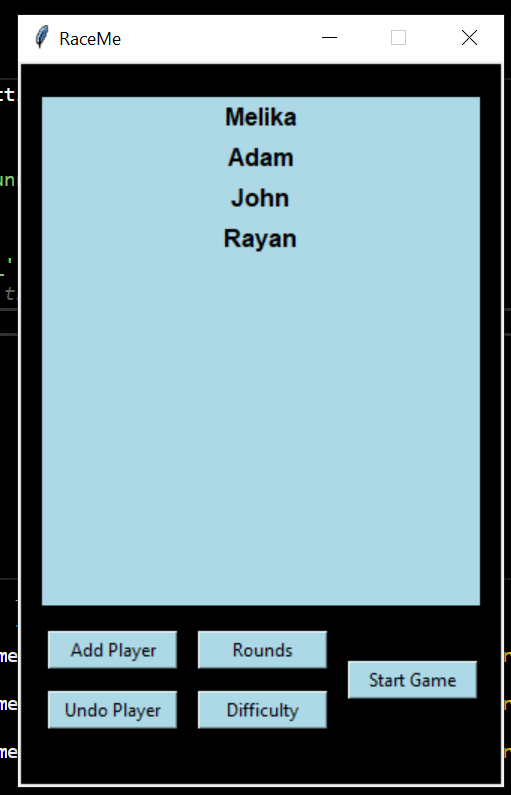

# RaceMe

## Description:
A minimal python game to practice arithmetic problems in a fun way. Mainly programmed using the Tkinter and python turtle modules. Start the game by running the 'RaceMe.py' script. 

## Usage:
The scripts include several python docstrings. The method names and code was designed to be easily understood and self-explanatory. The Game consists of 3 segments, if you will. You may tkinter around the code and change attributes such as the colors and shapes used, add more artherimc operations, or speed up the rounds. 

### Settings:
The first segment, the Settings, is where the user will define his racers; giving them a name and a color. The user may then define the number of rounds and the difficulty (Optional as their are default values set). The user may also undo the recently added player. When done, the user may press Start Game to commence the fun!

  
&nbsp; &nbsp; &nbsp; &nbsp;
  

### Game:
The second and main segment, the game, positions the racing lines and racers accordingly. The turtle race then starts and at every finished round, the winner is prompted an arithmetic challenge to solve, if correct, the user is granted 5 points. The next round is then started, etc. When the rounds are over, the Game closes and the leaderboard is brought up.

  
&nbsp; &nbsp; &nbsp; &nbsp;
  

### LeaderBoard
The third and final segment, the leaderboard, takes in the players and their scores as a dictionary, sorts them in desceding order and outputs the leaderboard through a tkinter GUI.

